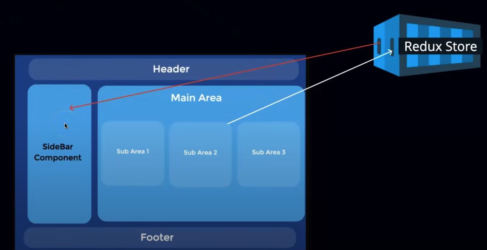
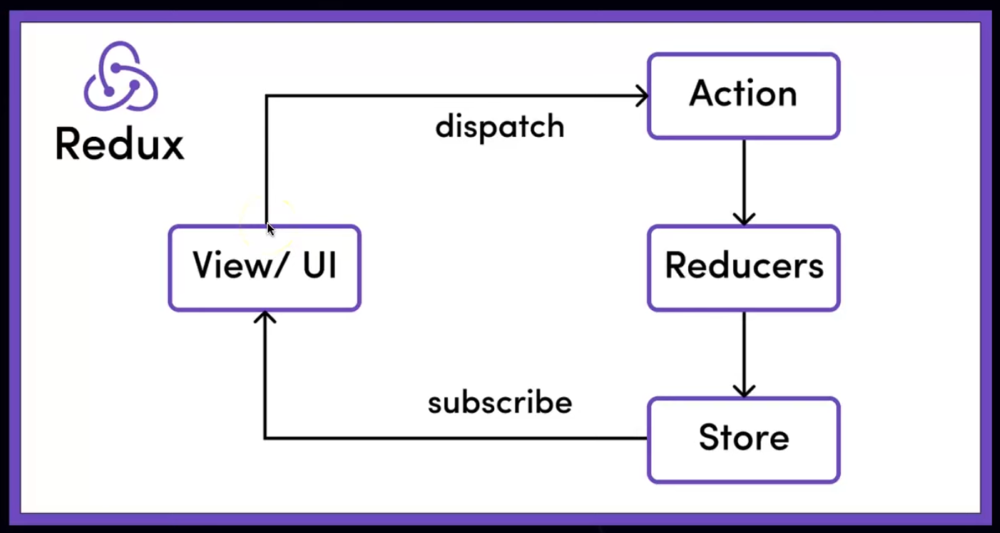

## Redux & RTK Architecture

> Architecture and flow for both are **almost** same.

In below image, if we need to send data from `<SubArea2>` component to `<Sidebar>` component, we use **Redux Store**.

Looks easy, let's see the underlying architecture:

### Redux Main components:
1. Action
2. Reducer
3. Store
4. Dispatcher

### Flow of data in Redux 

- Data gets dispatched/sent from `view/UI`.
- In `Action`, the data which needs to be stored/added/saved in `redux`'s store is present.
- `Reducer` makes the above happen i.e stores/updates/adds/save `action` data in the `store`.  
- `Store` is kind of the database for storing the data.
- Whenever we are in need of a data in a specific `View/UI`, we **subscribe** to it from the store.

## Changes in Redux ToolKit (RTK)

Here the both `Action` and `Reducers` are merged together into a single component known as **`Slice`**.

In simple terms,
**Slice**: `Action` + `Redcuers`.

> **Imp Point:** Specific Slice can be used for specific task.

